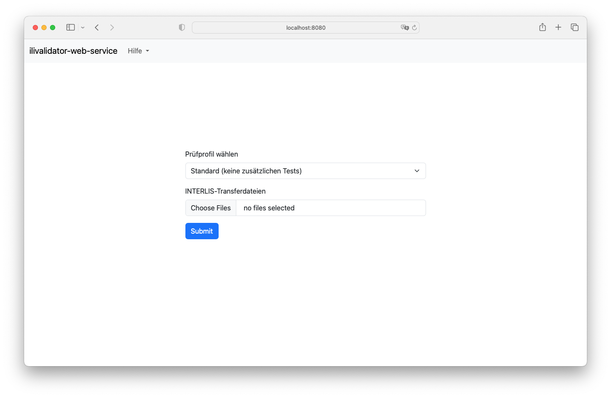
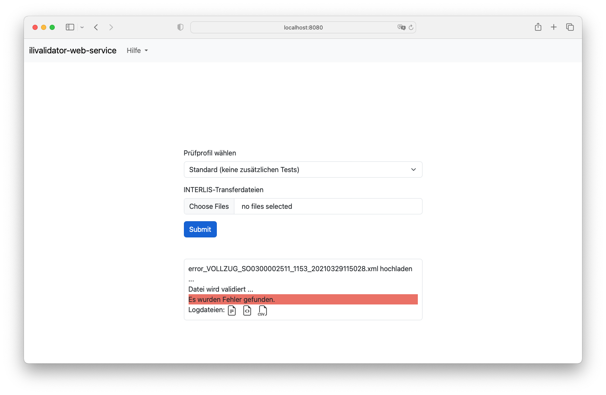

# Benutzerhandbuch

## Bedienung des Webservices

Der *ilivalidator web service* stellt eine einfache Art dar INTERLIS-Daten gegenüber einem INTERLIS-Modell zu prüfen (= Modellkonformität). Die zu prüfenden INTERLIS-Daten werden mittels Webformular auf einen Server hochgeladen, wo sie anschliessend automatisch geprüft werden. Das Prüfresultat wird als Logdatei (.log und .xtf) zum Download bereitgestellt. 

Beim Aufruf des *ilivalidator web services* erscheint folgendes Webformular:

Die zu prüfenden Dateien können durch Knopfdruck auf "Choose Files" ausgewählt werden. Die Dateien dürfen *nicht* gezippt sein und zusammen höchstens 300 Megabyte gross sein.

Im Feld neben "Choose Files" erscheint neu der Name der ausgewählten Datei.

Die Validierung kann durch Knopfdruck auf "Senden" gestartet werden. Der Knopf wird ausgegraut und es können keine weiteren Aktionen auf der Webseite vorgenommen werden. Im Browserfenster erscheinen die meldungen "<Dateiname> wird hochgeladen ..." und "Die Datei wird validiert ...". 

Die Prüfung kann - je nach Grösse der Datei resp. des Dateiinhaltes - ein paar Sekunden bis zu einigen Minuten dauern. Nach der Prüfung erscheint im Browser je nach Prüfresultat eine unterschiedliche Meldung. Wurden keine Fehler in der Datei gefunden, erscheinen die Meldung "Die Validierung ist abgeschlossen. Es wurden keine Fehler gefunden." und Links zu den beiden Logdateien.

Falls Fehler gefunden wurden, erscheint die Meldung "Die Validierung ist abgeschlossen. Es wurden Fehler gefunden."

## Visualisierung der Fehler

Neben der normalen Log-Datei steht ebenfalls die XTF-Log-Datei zum Download zur Verfügung ("Download XTF log file."). Diese kann dazu verwendet werden die Fehler im Erfassungssystem besser zu visualisieren. Achtung: Nicht jeder gefundende Fehler weist eine Koordinate auf, welche für die Visualisierung benötigt wird. Die XTF-Datei kann mit _ili2gpkg_ in eine GeoPackage-Dateiumgewandelt werden. _Ili2gpgk_ steht als Webservcie zur Verfügung: [https://geo.so.ch/ili2gpkg](https://geo.so.ch/ili2gpkg). Zusätzlich steht in QGIS ein Plugin zur Verfügung, welches die XTF-Datei direkt einlesen kann:

